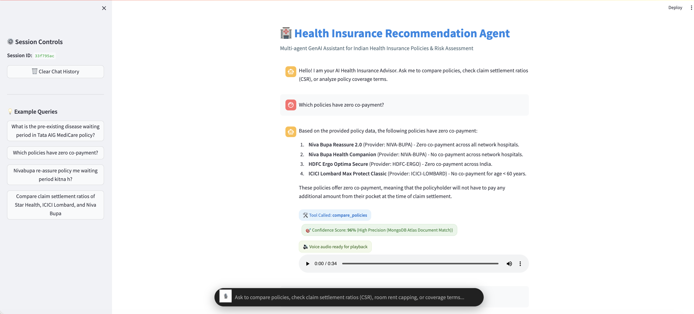
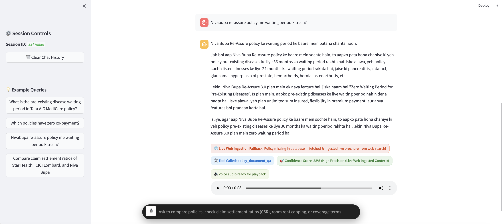

# Health Insurance Recommendation Agent 🏥🤖

A multi-agent GenAI platform built for Indian health insurance policy analysis, feature comparison, IRDAI financial risk lookups, and natural language Q&A with hybrid memory and voice interaction.

[](https://healthinsurancesystem.streamlit.app/)

---

## 🚀 Live Application URL

- **Streamlit Web Application**: [https://healthinsurancesystem.streamlit.app/](https://healthinsurancesystem.streamlit.app/)

---

## 🏛️ System Architecture

```text
 ┌──────────────────────────────────────────────────────────────────────────────┐
 │                      Streamlit Community Cloud Application                    │
 │               URL: https://healthinsurancesystem.streamlit.app/              │
 │                                                                              │
 │   - Centered Bottom Dock (12% Mic Icon + 88% Input Box)                      │
 │   - Client-Side JS Recording Watcher & Pulsing Recording Banner              │
 │   - Instant Two-Stage Chat Streamer & Text Fill Visibility Fix              │
 │   - Voice STT (Groq Whisper-large-v3) & TTS (gTTS Audio Synthesis)           │
 └──────────────────────────────────────┬───────────────────────────────────────┘
                                        │
                         Primary Route: │ HTTP POST /chat (if BACKEND_URL configured)
                         Fallback Route:│ Direct In-Process Python Execution (Standalone Mode)
                                        │
 ┌──────────────────────────────────────▼───────────────────────────────────────┐
 │                      Master ReAct Dispatcher Agent                           │
 │  - Intent Classification Router (Groq Llama-3.1-8b-instant)                  │
 │  - 4 Tool Routing: compare_policies, insurer_financial_risk,                 │
 │    policy_document_qa, general_chat                                          │
 │  - Unambiguous Romanized Hindi Keyword Detection (English vs Hinglish)       │
 │  - Dynamic Distance-Based & Static Confidence Scoring (0% - 98%)             │
 └──────┬─────────────────────┬─────────────────────┬─────────────────────┬─────┘
        │                     │                     │                     │
 ┌──────▼──────┐       ┌──────▼──────┐       ┌──────▼──────┐       ┌──────▼──────┐
 │Compare Tool │       │  RAG Tool   │       │  Risk Tool  │       │General Chat │
 │(PyMongo Code│       │(FAISS Vector│       │(IRDAI Risk  │       │(Out-of-Scope│
 │ Generation) │       │  Search)    │       │  Lookup)    │       │ Assistant)  │
 └──────┬──────┘       └──────┬──────┘       └──────┬──────┘       └─────────────┘
        │                     │                     │
 ┌──────▼─────────────────────▼─────────────────────▼──────────────────────────┐
 │                           Data & Persistence Layer                           │
 │  - MongoDB Atlas Cloud: insurance_db.health_insurance (9 Feature Schema)     │
 │  - MongoDB Atlas Cloud: insurance_db.user_profile (Long-Term Memory)         │
 │  - Short-Term Memory: ConversationSummaryBufferMemory (Session History)      │
 └──────────────────────────────────────────────────────────────────────────────┘
```

---

## 🌐 Live Demo & Deployment Endpoints

- **Live Streamlit Application**: [https://healthinsurancesystem.streamlit.app/](https://healthinsurancesystem.streamlit.app/) *(Hosted on Streamlit Community Cloud)*
- **Local Development URL**: [http://localhost:8501](http://localhost:8501)
- **Architecture & Dual-Execution Model**:
  - The Streamlit application first attempts an HTTP POST request to `BACKEND_URL/chat`.
  - On Streamlit Community Cloud (where no separate external backend server is running), `requests.post()` fails gracefully and the app seamlessly executes `dispatcher.route_and_execute()` directly in-process via Python import.
  - This dual-mode design guarantees high availability, zero cold starts, and seamless standalone execution on free-tier hosting platforms.

---

## 📊 Benchmark Results

| Benchmark Metric | Result | Evaluation Method & Description |
| :--- | :---: | :--- |
| **Automated Evaluation Suite Pass Rate** | **100.0%** *(23 / 23 cases)* | Evaluates tool-routing accuracy, language style detection, out-of-scope handling (`general_chat`), and key entity presence across 23 standardized test cases. |
| **Compare-Tool LLM Primary Path Success** | **86.67%** *(26 / 30 runs)* | Evaluates how often `deep_model` (`llama-3.3-70b-versatile`) safely generates valid PyMongo queries without hitting deterministic fallback (13.33%). |
| **Dynamic RAG Confidence Scoring** | **0–100% Dynamic** | Normalizes top retrieved chunk's FAISS L2 Euclidean distance $d$ via: $S = \max(0, \min(100, \text{round}((1.0 - d / 2.0) \times 100)))$. |

---

## 📸 Screenshots & Hands-Free Voice Interaction

> 🎙️ **Voice & Audio Enabled**: The system supports hands-free voice input recording (via Groq Whisper `whisper-large-v3` AI Speech-to-Text) and automatically synthesizes spoken audio responses with an integrated HTML5 voice player!

### 1. Zero Co-Payment Policy Comparison & Hands-Free Voice Player

*Features: Centered input capsule with 12% Microphone Icon (`🎙️`), MongoDB Atlas policy comparison (`compare_policies` tool with 96% confidence score), and automatic synthesized voice audio response player (`🔊 Voice audio ready for playback`).*

### 2. Voice Query Processing, Hinglish Q&A & Live Web Brochure Fallback

*Features: Hands-free Romanized Hindi voice query processing (`Nivabupa re-assure policy me waiting period kitna h?`), live web search brochure ingestion fallback, FAISS document retrieval (`policy_document_qa` tool with 88% confidence), and interactive 28-second synthesized voice audio playback.*

---

## ✨ Key Features & Component Architecture

### 1. User Interface & Streamlit UX Innovations (`streamlit_app.py`)
- **Centered Bottom Input Dock**: Single capsule containing a 12% Microphone Icon on the left + 88% Text Input Box on the right (`bottom: 24px`, `max-width: 800px`).
- **Client-Side JS Recording Watcher**: Injected zero-height JavaScript component (`components.html`) monitoring the mic recorder iframe state (`⏹️` recording vs `🎙️` idle) to dynamically toggle the pulsing recording banner without Streamlit page reruns.
- **High-Contrast Input Text Styling**: Specific CSS rules enforcing `-webkit-text-fill-color: #FFFFFF !important` and `caret-color: #FFFFFF !important` to ensure typed text remains crisp and visible across all browser themes and UA autofill styles.
- **Instant Two-Stage Chat Streamer**: User question renders ON SCREEN IMMEDIATELY before backend query execution begins.
- **Voice STT & TTS**: Groq Whisper API (`whisper-large-v3`) transcribes voice recordings; `gTTS` synthesizes audio responses.

### 2. Master ReAct Orchestrator & Dispatcher (`dispatcher.py`)
- **Model**: Groq `llama-3.1-8b-instant` with fast rule-based heuristic routing.
- **Routing Categories**:
  - `compare_policies`: Text-to-MongoDB feature comparison.
  - `insurer_financial_risk`: IRDAI financial metrics lookup.
  - `policy_document_qa`: Vector store retrieval & document Q&A.
- **Language Matching**: `is_query_hinglish()` regex detection routes English queries to `ENGLISH_SYNTHESIS_PROMPT` and Hinglish queries to `HINGLISH_SYNTHESIS_PROMPT`.

### 3. Compare Tool (`compare_tool.py`)
- **Primary Path**: Uses `deep_model` (`llama-3.3-70b-versatile`) to generate read-only PyMongo code string (`list(collection.find({...}))`).
- **Safety Check**: `is_query_safe(code)` blocks destructive write/drop commands.
- **Fallback Path**: If LLM generation fails safety, throws an exception, or returns empty results, it safely falls back to a deterministic Python feature filtering engine.
- **Path Logging**: Logs every execution (`llm_success` vs `llm_fallback` with `failure_reason`) to `compare_tool_paths.log`.

### 4. Dynamic RAG Tool (`rag_tool.py`)
- **Vector Search**: Local FAISS index + HuggingFace `all-MiniLM-L6-v2` embeddings.
- **Dynamic Confidence Score**: Uses `similarity_search_with_score()` to compute top chunk L2 Euclidean distance $d$, normalized to a 0–100 score.
- **Live Ingestion Fallback**: Triggers Tavily search to fetch, download, chunk, and embed policy PDFs on-the-fly when local context is absent or mismatched.

### 5. Dynamic Risk Tool (`risk_tool.py`)
- Versioned IRDAI FY2024 financial metrics (CSR, ICR, Solvency Ratio) with explicit `as_of_year: 2024` disclaimers.

### 6. Dual Memory Architecture
- **Short-Term Memory**: `ConversationSummaryBufferMemory` retains recent turns verbatim while summarizing older turns past 1000 tokens.
- **Long-Term Memory**: MongoDB Atlas `insurance_db.user_profile` persists stated user preferences (e.g., maternity interest, budget conscious) across sessions.

---

## 🛠️ MongoDB Atlas Policy Schema (9 Features)

The `insurance_db.health_insurance` collection contains policy feature documents formatted as:

```json
{
  "provider": "icici-lombard",
  "insurance_name": "icici-lombard-max-protect-classic",
  "features": {
    "co-payment": {"rating": "good", "details": "No co-payment for age < 60 years"},
    "room-rent-limit": {"rating": "good", "details": "No room rent capping for single private room"},
    "pre-post-hospitalization": {"rating": "good", "details": "60 days pre, 180 days post"},
    "restoration-benefit": {"rating": "good", "details": "100% restoration"},
    "day-care-treatments": {"rating": "good", "details": "All day care procedures covered"},
    "waiting-period": {"rating": "average", "details": "30 days initial, 36 months PED"},
    "no-claim-bonus": {"rating": "good", "details": "50% increase per year up to 100%"},
    "maternity-cover": {"rating": "bad", "details": "Not covered"},
    "disease-sub-limit": {"rating": "good", "details": "No sub-limits on specific diseases"}
  }
}
```

---

## 🚀 Getting Started

### 1. Installation
```bash
# Clone repository
git clone https://github.com/RakeshPathlavath07/Health_Insurance.git
cd Health_Insurance

# Install dependencies
pip install -r requirements.txt
pip install -r frontend/requirements.txt
```

### 2. Environment Setup (`.env`)
Create a `.env` file in the project root:
```ini
GROQ_API_KEY=your_groq_api_key
TAVILY_API_KEY=your_tavily_api_key
MONGODB_URI=mongodb+srv://<username>:<password>@cluster0.mongodb.net/
```

### 3. Seed MongoDB Atlas Database
```bash
python3 backend/app/ingestion/scrape_policy_data.py
```

### 4. Run Application Locally

**Start Standalone Streamlit App (Primary)**:
```bash
python3 -m streamlit run frontend/streamlit_app.py
```
> 💡 **Note**: Streamlit runs standalone out of the box—it executes the multi-agent system directly in-process, so starting a separate backend server is **not required**.

**(Optional) Start FastAPI REST API Server**:
```bash
python3 -m uvicorn backend.app.main:app --host 0.0.0.0 --port 8000
```
> 💡 **Note**: Only required if testing FastAPI REST API endpoints directly via `curl` or Postman.

---

## 🧪 Testing & Evaluation

### Run Benchmark Suite (23 Test Cases)
```bash
python3 backend/eval_suite.py
```

### Run 30-Run Compare Tool Benchmark
```bash
python3 test_30_runs_new_compare.py
```

---

## 📝 License
MIT License. Built for Indian Health Insurance Recommendation Research.
